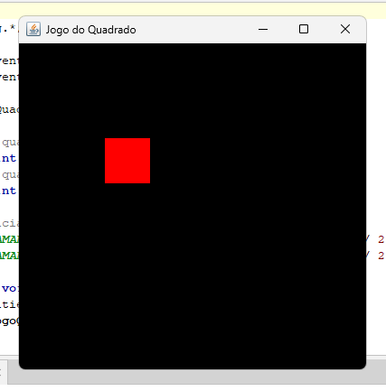

# Nome do Jogo

Pequeno jogo em Java desenvolvido por mim.

## Prints do Jogo

Ecrã do jogo:  

## Como correr o projeto

1. Compila o código Java:
   Podes usar o VSCode ou o NetBeans
2. Executa:
  Seleciona a pasta src -> RUN JogoQuadrado.java

## Tecnologias usadas

- Java

---
